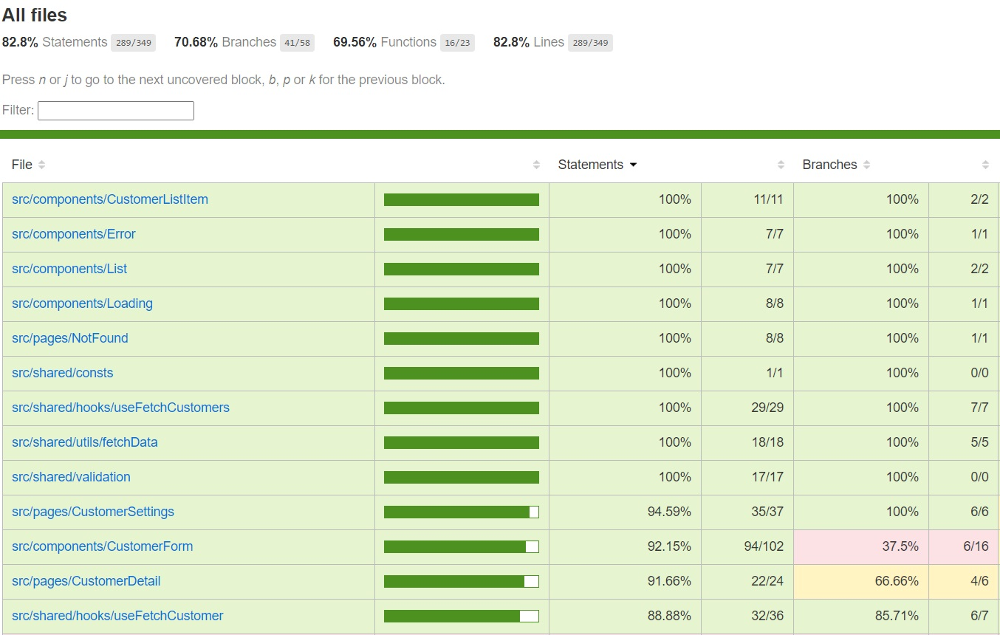

## Overview

This is a React project built with TypeScript, React, React-hook-form, Vite, and Vitest for testing. The project includes reusable components, pages, custom hooks, and testing.

## Project Structure

```bash
src/
│
├── components/              # Reusable components
│   ├── CustomerForm/         # Component for handling customer form
│   ├── CustomerListItem/     # Component for rendering individual customer items
│   ├── Error/                # Error component to handle API errors
│   ├── List/                 # Generic list component
│   └── Loading/              # Loading spinner component
│
├── pages/                   # Pages for routing
│   ├── CustomerDetail/       # Page for detailed view of a customer
│   ├── CustomerSettings/     # Page for managing customer settings
│   └── NotFound/             # 404 Page
│
├── routers/                 # App Router configurations
│   └── AppRouter.tsx         # Main app router configuration
│
├── shared/                  # Shared utilities and hooks
│   ├── consts/               # API constants
│   ├── hooks/                # Custom hooks for API data fetching
│       ├── useFetchCustomer/ # Hook to fetch a single customer by ID
│       └── useFetchCustomers/ # Hook to fetch a list of customers
│   └── types/               # TypeScript type definitions
│
├── utils/                   # Utility functions
│   └── fetchData/            # API fetching utility
│
└── validation/              # Form validation logic 
```

## Pages

- **CustomerDetail**: Provides a detailed view of a single customer, allowing the user to view or edit customer information.
- **CustomerSettings**: Lists all customers and allows the user to navigate to the detail view of a selected customer.
- **NotFound**: Displays a 404 error page if the requested route does not exist.

## Components

- **CustomerForm**: A form component used to update customer details. It utilizes `react-hook-form` for handling form state and validation. This library helps simplify form management by providing built-in support for form field registration, error handling, and validation integration.
- **CustomerListItem**: Displays individual customer information in a list format.
- **Error**: A reusable error component for displaying error messages.
- **List**: A reusable component to render any list of items.
- **Loading**: Displays a loading spinner when data is being fetched.

## Hooks
- **useFetchCustomer**: Custom hook to fetch a single customer by ID from the API.
- **useFetchCustomers**: Custom hook to fetch a list of customers from the API.

## FetchData
Fetches data from a specified API endpoint and returns the parsed JSON response.
This utility function simplifies and centralizes the logic for making API requests, making it reusable across the project.

Code Reusability: By encapsulating the fetch logic in a single function, `fetchData` can be easily reused in custom hooks like `useFetchCustomers` and `useFetchCustomer`. This reduces code duplication and ensures consistent error handling and data processing across different components that interact with the API.


## Testing

### Overview

The project includes unit tests for all core functionality, ensuring the app behaves as expected under different conditions. All tests are written using the `@testing-library/react` along with Vitest as the test runner.

The test files are co-located with their respective components or hooks, making it easier to understand what part of the application each test is validating. Each feature of the app has corresponding unit tests.

### Test Coverage

The test coverage for this project is quite comprehensive, as seen in the screenshot below.



- **Statements Coverage**: 82.8%
- **Branches Coverage**: 70.68%
- **Functions Coverage**: 69.56%
- **Lines Coverage**: 82.8%

The coverage reports are generated using Vitest with the coverage option.

## Getting Started

### Install all packages
> `npm install`

### Running the Server 
> `npm start`

### Running Unit Tests
> `npm test`

### Generating test coverage reports
> `npm coverage`
